# ThreeQ 系列研究报告

最后更新：2026-04-19
当前状态：第一轮理论整理、最小可比较实验、DThreeQ 可行性筛查、DThreeQ 机制诊断、Dplus 修正诊断、MNIST 小预算压力筛查、legacy MNIST 复现实验、DThreeQ MNIST focused/longrun 筛查、EPThreeQ 调参、DThreeQ objective/activation/prediction audit、收敛性/发散性 LaTeX 报告、系统版学术报告已完成。

## 1. 执行摘要

本项目研究的是一类基于“对称/双向局部预测 + 截断梯度状态更新”的能量模型。核心目标不是直接复制反向传播，而是构造一个局部状态动力学：每层状态由相邻层双向预测，状态推断使用局部能量下降，权重更新只通过固定后的自由相/受扰相状态产生。

截至目前的结论可以压缩为九点：

1. **理论上，局部 inference 收敛是可以保证的。** 在母模型 $T(u,W)=\frac{1}{n-1}Wg(u)$ 下，如果固定点处 Jacobian $J(u^*,W)$ 满足 $\rho(J)<1$，则固定点局部指数稳定；若训练步长足够小且梯度有界，该稳定性在一次参数更新后保持。
2. **稳定性不等于表达能力或训练有效性。** 截断/饱和激活、局部平均预测、状态 detach 会让系统更稳定，但也削弱非线性表示和跨层 credit assignment。
3. **当前最小 two-moons 可比较实验中，EP 更新优于 direct 更新，但仍不稳。** `ep_cost_w50` 有最好的 mean best validation error 0.1783，但 final validation error 回退到 0.2817，且权重尺度最大；`ep_cost_w10` 更稳但上限较低。
4. **当前 DThreeQ/Dplus 规则没有通过 BP-like 机制诊断。** Dplus 与 BP 的 forward-only 更新方向几乎不对齐，cosine 仅约 0.03 到 0.08；Dplus 与 EP 在 one-sided targets 上高度同向，但 norm ratio 极小，说明它更像“尺度塌缩的 EP-like 更新”，不是 BP-like 更新。
5. **Residual normalization / beta scaling / layer-wise gain 主要修正尺度，不修正方向。** 新的 Dplus fix diagnostic 中，best candidate 的 `dplus_vs_bp` forward cosine 只从 raw direct 的 0.07598 提到 0.07624，sign agreement 仍为 0.5685；但 BP/EP norm-calibrated one-step free-MSE decrease 全部为正，说明该规则有局部下降成分，只是 credit assignment 方向仍没有被改写。
6. **MNIST 小预算压力筛查不能代表原始 ThreeQ 设定。** 在 3000 train / 1000 test / 3 epoch 的统一 small screen 中，BP MLP 与 BP CNN 的 mean best test error 分别为 0.1114 和 0.1188；而公共实现下的 ThreeQ/EPThreeQ/DThreeQ/Dplus/CNNThreeQ/EPCNNThreeQ 均停在 0.8668 到 0.9163。这个结果说明短训练、弱容量、公共抽象和高维输入能量会让当前实现接近随机，但不能否定 legacy net1 配置。
7. **直接调用 legacy 类后，MNIST 已明显离开随机水平，且 EPBase3Q 更稳更快。** 在 5000 train / 1000 valid / 8 epoch 的 reproduction-style screen 中，`EPBase3Q` best validation error 为 0.225，`Base3Q` 为 0.398；这与原始代码可达较高 MNIST 准确率的观察一致，也说明之前 small screen 的主要问题是实验预算和配置不匹配，而不是网络必然无法学习。
8. **EPThreeQ 的 legacy 路线已回到约 86.5% accuracy。** 在 10k train / 2k valid / 15 epoch 的原始 `EPBase3Q` 调参中，`beta=1.0` 达到 0.1345 best validation error，`weak_steps=5` 达到 0.1350；这验证了用户观察到的“原始版本约 85% 且 EP 更稳”是由预算和 legacy 设置支撑的，而不是偶然现象。
9. **当前 DThreeQ MNIST 实现尚未复现 90%+，但边界更清楚。** EP-nudge 主线在 10k/2k、30 epoch 下稳定到 0.1606 mean best test error；高学习率可把 best error 短暂推到 0.1545，但一个 seed 后期崩溃。plus-energy、target matching、`sigmoid`、`relu`、`clip01`、非负状态区间、线性边预测和 activated initialization 都未超过该主线；因此外部 90%+ DThreeQ 很可能包含不同 objective、标签编码、优化器、输入能量归一化、readout/CE 辅助或更大训练预算。

因此，后续 MNIST 研究需要分清四条线：第一，用 legacy 配置复现并扩展到完整 50k/10k benchmark；第二，在公共框架中逐项对齐架构、状态步数、学习率和初始化；第三，继续把 Dplus 从“可缩放的 EP-like 局部下降”改造成真正能改善跨层 credit assignment 的目标；第四，优先核对外部 90%+ DThreeQ 的训练目标是否等同于当前 residual-delta Dplus/EP-nudge 实现。

## 2. 代码与实验结构

当前仓库可分为四层：

| 层级 | 路径 | 作用 |
|---|---|---|
| 理论母模型 | `Provement/inferenceProve.tex` | 固定点、Jacobian、谱条件、小学习率稳定性证明 |
| 早期原型 | `AllConnected3Q*`、`Base3Q*`、`EPBase3Q*`、`CNN3Q*`、`EPCNN3Q*` | 原始探索脚本和 twomoons/MNIST/CNN 变体 |
| 公共实现 | `threeq_common/` | 可比较 MLP/DThreeQ/机制诊断/Dplus 修正诊断实现 |
| radas 实验 | `experiments/minimal_suite/`、`experiments/dthreeq_suite/`、`experiments/mechanism_diagnostic/`、`experiments/dplus_fix_diagnostic/`、`experiments/mnist_suite/`、`experiments/mnist_legacy_repro/`、`experiments/mnist_epthreeq_tune/`、`experiments/mnist_dthreeq_focus/`、`experiments/mnist_dthreeq_longrun/`、`experiments/mnist_dthreeq_objective_audit/`、`experiments/mnist_dthreeq_activation_boost/`、`experiments/mnist_dthreeq_clip01_boost/`、`experiments/mnist_dthreeq_prediction_audit/`、`experiments/analysis_summary/` | 可复现的参数矩阵、结果物化、图表和汇总 |
| 论文材料 | `paper_assets/` | 面向论文写作的统一编号图、关键结果表、机制诊断表和中文摘要 |

后续所有实验都应优先落在 `experiments/<suite_name>/` 中，并把结果写入该 suite 的 `results/` 子目录，再更新本报告。

## 3. 理论结果：局部收敛与小步训练鲁棒性

### 3.1 母模型定义

证明文档考虑 $n$ 维状态 $u\in\mathbb{R}^n$，定义局部预测映射：

$$
T(u,W)=\frac{1}{n-1}Wg(u)
$$

连续时间 inference 动力学为：

$$
\dot u=-\beta(u-T(u,W)),\qquad \beta>0
$$

固定点满足：

$$
u^*(W)=T(u^*(W),W)
$$

令 $D(u)=\mathrm{diag}(g'(u_1),\dots,g'(u_n))$，则固定点附近的 Jacobian 为：

$$
J(u,W)=\frac{\partial T}{\partial u}(u,W)=\frac{1}{n-1}WD(u)
$$

### 3.2 局部指数稳定

在固定点 $u^*$ 附近，扰动 $\delta=u-u^*$ 满足：

$$
\dot \delta=-\beta(I-J(u^*,W))\delta+\beta r(\delta)
$$

其中 $r(\delta)=o(\|\delta\|)$。若

$$
\rho(J(u^*,W))<1
$$

则 $-\beta(I-J)$ 是 Hurwitz 矩阵，线性化系统指数稳定；再由 Lyapunov 间接法，原非线性系统在该固定点局部指数稳定。

证明中的更精确条件其实是 $\mathrm{Re}(\lambda_k(J))<1$，而 $\rho(J)<1$ 是更强但更易用于实验诊断的充分条件。

### 3.3 固定点分支与训练鲁棒性

定义残差：

$$
F(u,W)=u-T(u,W)
$$

若 $\det(I-J(u^*,W))\neq 0$，隐函数定理给出局部唯一且 $C^1$ 的固定点分支 $u^*(W)$。由于 $W\mapsto J(u^*(W),W)$ 连续，且谱半径连续，所以满足 $\rho(J)<1$ 的参数集合是开集。

训练步写作：

$$
W^+=W-\eta\nabla_W E(u^*(W),W)
$$

若 $\|\nabla_W E\|\le G$，且当前点有稳定裕度 $\rho(J)\le 1-\varepsilon$，则存在 $\eta_{\max}>0$，当 $0<\eta<\eta_{\max}$ 时，更新后仍有 $\rho(J(W^+))<1$，从而 inference 仍局部收敛。

### 3.4 理论边界

这个证明只保证局部 inference 稳定，不保证：

- 学到的表示有足够非线性；
- 权重更新方向接近 BP；
- 受扰相能产生有效 credit assignment；
- 长训练过程始终留在同一稳定邻域；
- 饱和带来的稳定性不会同时压制梯度信号。

这正是后续实验中观察到“收敛但弱表达、稳定但训练慢”的根源。

## 4. 模型家族

### 4.1 基础 ThreeQ / Base3Q

基础分层 MLP 使用每层状态 $x_i$，由相邻层双向预测：

- 下层到上层：`forward_weights`
- 上层到下层：`backward_weights`
- 激活：hard clipping $\rho(x)=\mathrm{clip}(x,0,1)$
- 状态推断：free phase 后接 weak/clamped phase
- direct 权重更新：对受扰相 total energy 直接求权重梯度

对应实现包括 `Base3Q/`、`Base3QClampWithLinear/`，以及公共版本 `threeq_common/models.py`。

基础 ThreeQ 的主要问题是：hard clipping 提供了稳定性，但很容易让状态进入饱和或近线性区域；同时局部 detach 使跨层误差信号很弱，导致 two moons 和 MNIST 上训练效率低、非线性能力弱。

### 4.2 EPThreeQ / EPBase3Q

EPThreeQ 将权重目标从 direct total energy 改为近似 EP 差分：

$$
\Delta W \propto -\nabla_W\frac{E(s_\beta,W)-E(s_0,W)}{\beta}
$$

对应实现包括 `EPBase3Q/`、`EPBase3QClampWithLinear/` 和公共实验中的 `weight_update="ep"`。

EP 的优点是：相比 direct objective，它更接近“自由相与受扰相能量差”带来的局部学习信号。当前结果也显示 EP 类变体在 two moons 上明显优于 direct 类变体。

EP 的问题是：受扰相步数和 $\beta$ 需要精细平衡。weak steps 太少时信号不足；weak steps 太多时可能出现 early-best 后回退、权重尺度膨胀和 final accuracy 下降。

### 4.3 CNNThreeQ / EPCNN3Q

CNN 版本把 MLP 的局部双向预测推广到卷积结构：

- 正向预测使用 `conv2d`
- 反向预测使用 `conv_transpose2d`
- 卷积核天然对应严格转置共享
- 输出层使用全连接 `fc_kernel` 与转置

对应实现包括 `CNN3Q/` 和 `EPCNN3Q/`。

这类结构在形式上更接近“严格对称结构”，但当前仓库只有 legacy decision-boundary 图和脚本，没有像 minimal suite 那样完整的多 seed 可比较表。因此本报告暂不把 CNN 结果放入数值排名，只把它作为结构推广方向保留。

### 4.4 DThreeQ / Dplus

DThreeQ 使用 tanh 状态、双向局部 residual，并比较自由相与 clamped/nudged 相的 residual 变化：

$$
\mathcal{L}_{D+}=\frac{1}{2}\sum_e\|r_e^{\beta}-r_e^0\|^2
$$

实验中包括：

- direct clamp
- nudge with $\beta=0.1,0.01,0.001$
- gradual clamp
- plus / plusminus sign
- BP 和 EP 对照组

DThreeQ 的初衷是避免直接依赖 EP 能量差，转而学习“受监督扰动导致的局部 residual 改变量”。但当前机制诊断显示：Dplus 与 BP 不对齐，且尺度严重塌缩；plusminus 还会发生符号抵消。

## 5. 可比较实验结果

### 5.1 Minimal Comparable Suite

实验路径：`experiments/minimal_suite/`  
结果路径：`experiments/minimal_suite/results/`  
综合图表：`experiments/analysis_summary/results/figures/`

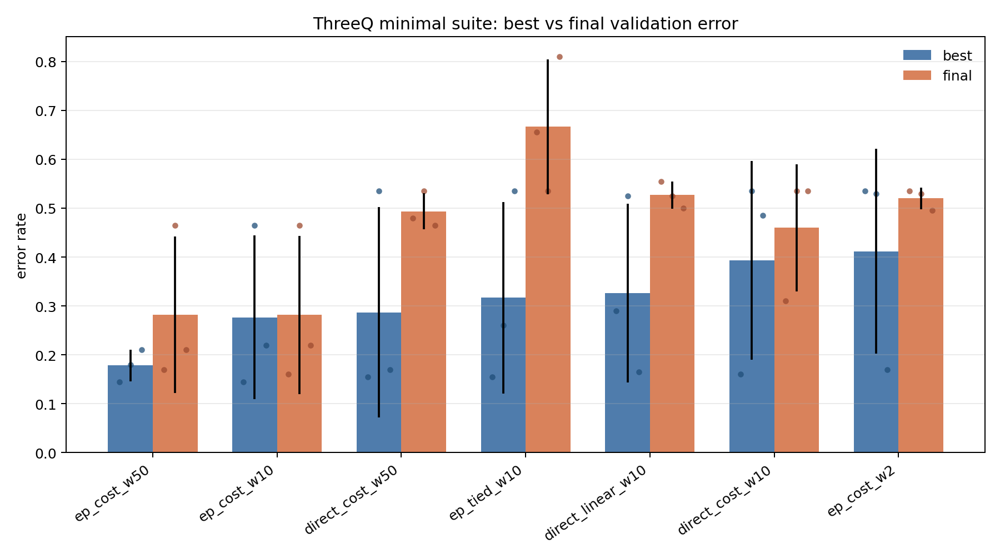

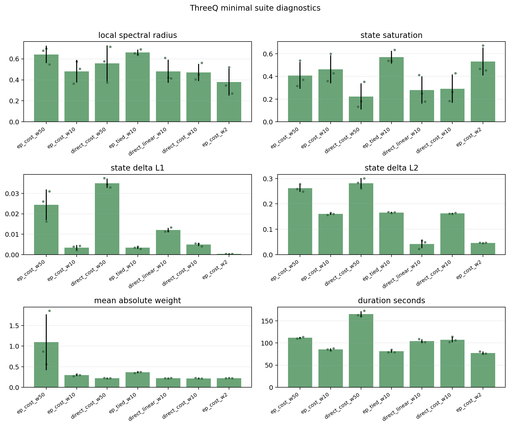

| variant | best valid mean | final valid mean | rho mean | saturation mean | weight abs mean |
|---|---:|---:|---:|---:|---:|
| `ep_cost_w50` | 0.1783 | 0.2817 | 0.6410 | 0.4084 | 1.0956 |
| `ep_cost_w10` | 0.2767 | 0.2817 | 0.4808 | 0.4628 | 0.2929 |
| `direct_cost_w50` | 0.2867 | 0.4933 | 0.5558 | 0.2232 | 0.2217 |
| `ep_tied_w10` | 0.3167 | 0.6667 | 0.6607 | 0.5690 | 0.3626 |
| `direct_linear_w10` | 0.3267 | 0.5267 | 0.4814 | 0.2803 | 0.2200 |
| `direct_cost_w10` | 0.3933 | 0.4600 | 0.4713 | 0.2915 | 0.2169 |
| `ep_cost_w2` | 0.4117 | 0.5200 | 0.3787 | 0.5312 | 0.2218 |

结论：

- `ep_cost_w50` 的 best checkpoint 最好，但 final error 回退，且权重尺度最大。
- `ep_cost_w10` 更稳，但 best performance 不如 `ep_cost_w50`。
- `ep_cost_w2` 受扰相太弱，训练信号不足。
- 严格转置共享的 `ep_tied_w10` final accuracy 很差，说明 tying alone 不是充分条件。

### 5.2 DThreeQ Two-Moons Screen

实验路径：`experiments/dthreeq_suite/`  
结果路径：`experiments/dthreeq_suite/results/`

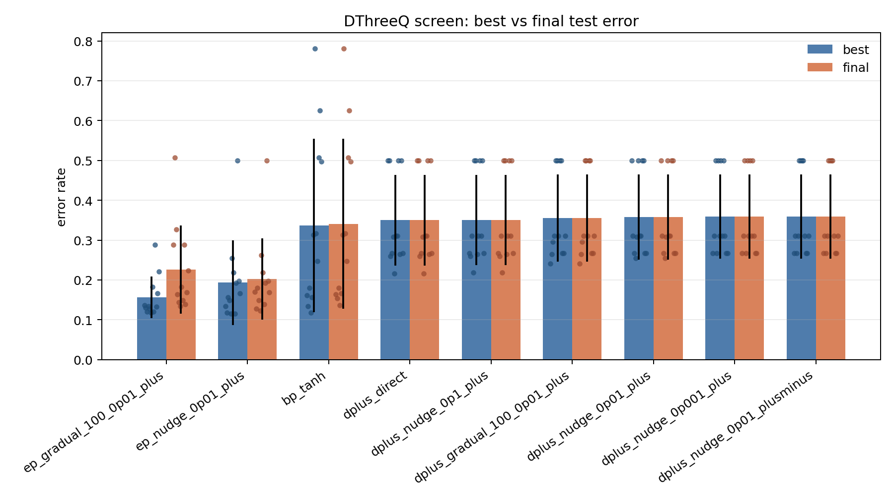

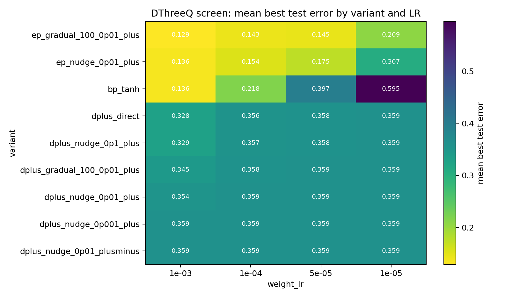

| variant | best test mean | best test min | final test mean | state delta mean | weight abs mean |
|---|---:|---:|---:|---:|---:|
| `ep_gradual_100_0p01_plus` | 0.1565 | 0.1178 | 0.2264 | 0.0933 | 0.3143 |
| `ep_nudge_0p01_plus` | 0.1931 | 0.1154 | 0.2023 | 0.0233 | 0.1808 |
| `bp_tanh` | 0.3365 | 0.1178 | 0.3407 | n/a | n/a |
| `dplus_direct` | 0.3502 | 0.2163 | 0.3502 | 0.1779 | 0.0600 |
| `dplus_nudge_0p1_plus` | 0.3506 | 0.2188 | 0.3506 | 0.1434 | 0.0598 |
| `dplus_gradual_100_0p01_plus` | 0.3554 | 0.2404 | 0.3554 | 0.1116 | 0.0596 |
| `dplus_nudge_0p01_plus` | 0.3578 | 0.2548 | 0.3578 | 0.0284 | 0.0588 |
| `dplus_nudge_0p001_plus` | 0.3590 | 0.2668 | 0.3590 | 0.0054 | 0.0586 |
| `dplus_nudge_0p01_plusminus` | 0.3590 | 0.2668 | 0.3590 | 0.0301 | 0.0586 |

结论：

- 当前 Dplus 变体没有通过 two moons 第一轮筛查。
- Dplus 系列 mean best test error 基本停在 0.35 附近，并且很多 seed/LR 组合接近 chance-error。
- Dplus saturation 接近 0，说明失败不是 tanh clipping 饱和主导。
- 更可能的问题是 update/objective alignment：residual target、detach 路径、符号构造或尺度没有产生有效下降方向。

### 5.3 DThreeQ Mechanism Diagnostic

实验路径：`experiments/mechanism_diagnostic/`  
结果路径：`experiments/mechanism_diagnostic/results/`

该实验在同一批 mini-batch 和同一初始参数上比较 BP、EP、Dplus 的更新向量。BP 只更新 forward weights/biases，backward 参数在 full vector 中补零；因此主要结论使用 forward-only 指标。

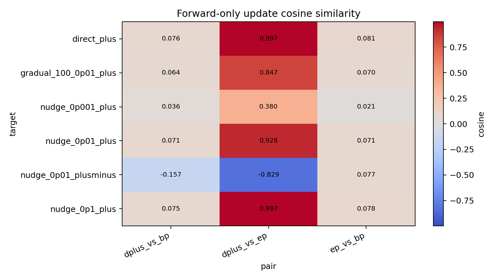

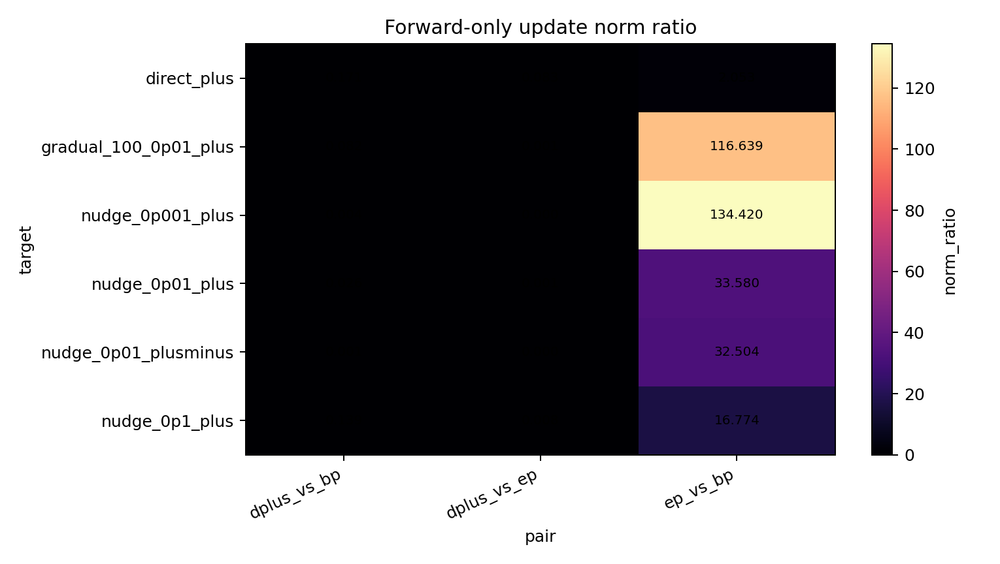

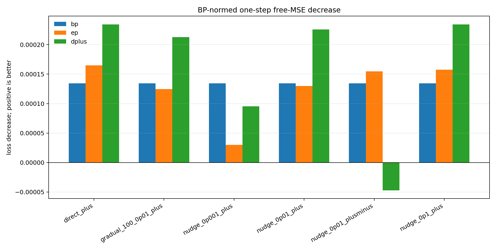

| target | pair | cosine | norm ratio | sign agreement |
|---|---|---:|---:|---:|
| `direct_plus` | `dplus_vs_bp` | 0.0760 | 0.1705 | 0.5685 |
| `gradual_100_0p01_plus` | `dplus_vs_bp` | 0.0642 | 0.0817 | 0.5303 |
| `nudge_0p001_plus` | `dplus_vs_bp` | 0.0363 | 0.0036 | 0.5013 |
| `nudge_0p01_plus` | `dplus_vs_bp` | 0.0711 | 0.0259 | 0.5064 |
| `nudge_0p01_plusminus` | `dplus_vs_bp` | -0.1574 | 0.0013 | 0.4973 |
| `direct_plus` | `dplus_vs_ep` | 0.9971 | 0.0831 | 0.9879 |
| `nudge_0p01_plus` | `dplus_vs_ep` | 0.9276 | 0.0008 | 0.9898 |
| `nudge_0p01_plusminus` | `dplus_vs_ep` | -0.8290 | 4.62e-05 | 0.5167 |

| target | method | raw free-MSE decrease | BP-normed free-MSE decrease | raw positive rate |
|---|---|---:|---:|---:|
| `direct_plus` | BP | 1.34e-04 | 1.34e-04 | 1.0000 |
| `direct_plus` | Dplus | 3.57e-05 | 2.34e-04 | 1.0000 |
| `nudge_0p01_plus` | Dplus | 5.37e-06 | 2.26e-04 | 1.0000 |
| `gradual_100_0p01_plus` | EP | 2.43e-02 | 1.24e-04 | 1.0000 |
| `nudge_0p01_plusminus` | Dplus | -2.96e-07 | -4.71e-05 | 0.0000 |

结论：

- Dplus 与 BP 几乎不对齐，forward cosine 约 0.03 到 0.08，sign agreement 接近随机。
- Dplus 与 EP 在 one-sided plus targets 上高度同向，但 norm ratio 极小，说明它是尺度塌缩的 EP-like 更新。
- `plusminus` 是明确失败模式，会发生方向抵消，raw 和 BP-normed one-step loss 都不下降。
- EP raw step 下降最大，但主要来自极大的向量范数；BP-normed 后 EP 并不稳定优于 BP。

### 5.4 Dplus Fix Diagnostic

实验路径：`experiments/dplus_fix_diagnostic/`
结果路径：`experiments/dplus_fix_diagnostic/results/`

这轮实验直接检验上一节提出的五个修正方向：

- 只保留 one-sided plus targets，禁用 `plusminus` 主线；
- 对 Dplus objective 做 $\beta^{-1}$、$\beta^{-2}$ 缩放；
- 对 $r_\beta-r_0$ 做 residual RMS normalization；
- 对浅层 residual delta 加固定 layer-wise gain；
- 在机制诊断里同时记录 BP/EP forward-norm calibrated one-step loss decrease。

实验矩阵为 5 个 plus-only target $\times$ 7 个 objective variant $\times$ 3 个 seed，共 105 个 trial。

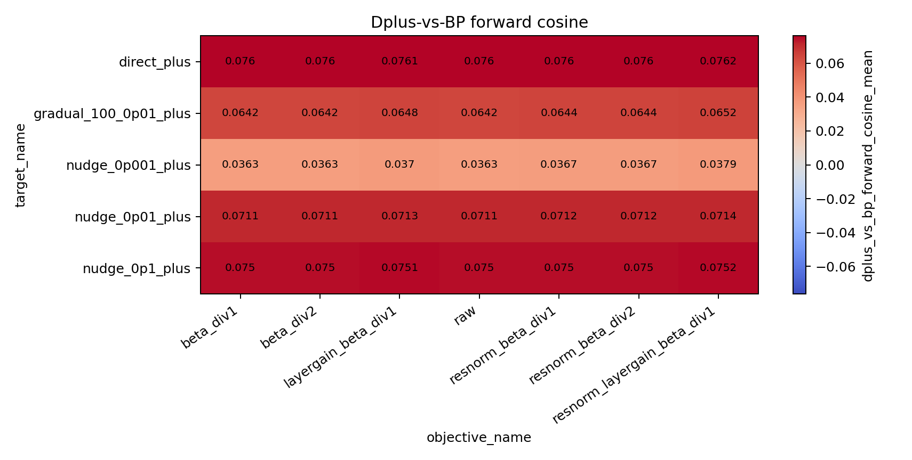

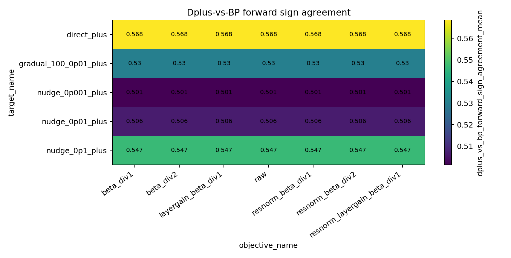

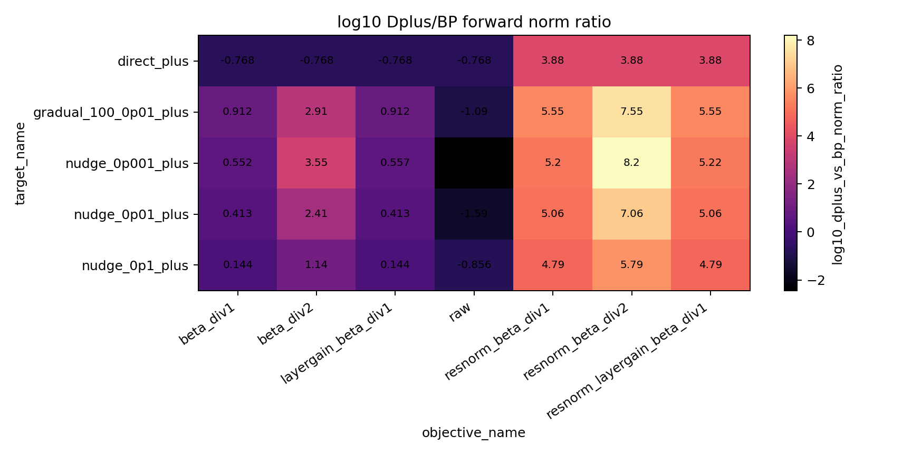

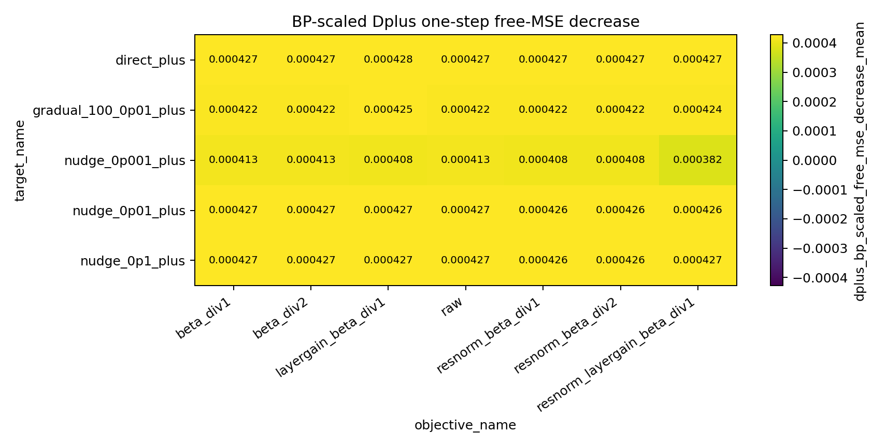

| objective | target | BP cosine | BP sign | Dplus/BP norm | EP cosine | raw free-MSE decrease | BP-scaled free-MSE decrease | BP-scaled CE decrease |
|---|---|---:|---:|---:|---:|---:|---:|---:|
| `resnorm_layergain_beta_div1` | `direct_plus` | 0.07624 | 0.5685 | 7619 | 0.9975 | 3.21e-02 | 4.27e-04 | 2.23e-05 |
| `layergain_beta_div1` | `direct_plus` | 0.07613 | 0.5685 | 0.1705 | 0.9973 | 6.51e-05 | 4.28e-04 | 2.23e-05 |
| `resnorm_beta_div1` | `direct_plus` | 0.07602 | 0.5685 | 7619 | 0.9972 | 3.21e-02 | 4.27e-04 | 2.23e-05 |
| `raw` | `direct_plus` | 0.07598 | 0.5685 | 0.1705 | 0.9971 | 6.50e-05 | 4.27e-04 | 2.22e-05 |

结论：

- **方向没有被修正。** 最好的 `resnorm_layergain_beta_div1/direct_plus` 只把 BP cosine 从 raw direct 的 0.07598 提到 0.07624，幅度可以忽略；sign agreement 仍停在 0.5685。
- **尺度可以被修正，但这不等于 credit assignment 被修正。** `layergain_beta_div1/direct_plus` 的 raw Dplus/BP norm ratio 仍是 0.1705；BP-norm calibration 后 free-MSE decrease 变成 4.28e-04，超过 BP baseline 的 1.34e-04，但方向仍主要是 EP-like。
- **Residual normalization 有风险。** 它能把 raw free-MSE decrease 放大到约 3.2e-02，但也把 Dplus/BP norm ratio 推到 $10^3$ 到 $10^8$ 量级，并且 raw feedforward CE decrease 可变成负值；因此它只能和显式 norm calibration 配套使用。
- **Layer-wise gain 不是方向解法。** 固定 gain 的数值更可控，但对 BP cosine 几乎没有实质提升。
- **Direction regularizer 的第一版筛选过宽。** 所有 plus-only 候选都通过了 BP/EP-scaled free-MSE positive-rate 筛选，但仍没有拉近 BP 方向；下一版筛选必须把 `dplus_vs_bp` cosine/sign agreement 明确作为硬门槛，而不是只看 one-step free-MSE 是否下降。

因此，本轮 Dplus 修正诊断的判断是：plus-only + norm calibration 可以作为稳定训练时的安全步长控制，但 residual normalization、$\beta$ 缩放和固定 layer gain 还没有解决 Dplus 的核心机制问题。下一步需要改变 residual target 的结构，而不是继续只调标量尺度。

### 5.5 Legacy CNN / Decision Boundary Figures

这些图来自早期脚本，未配套多 seed 可比较表；因此只作为结构探索记录，不参与主排名。

| 模型 | 图 |
|---|---|
| Base3QClampWithLinear | 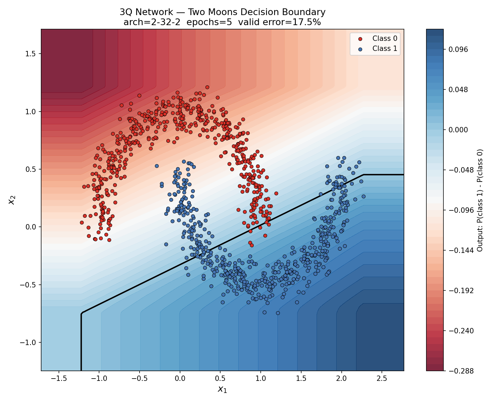 |
| EPBase3Q | 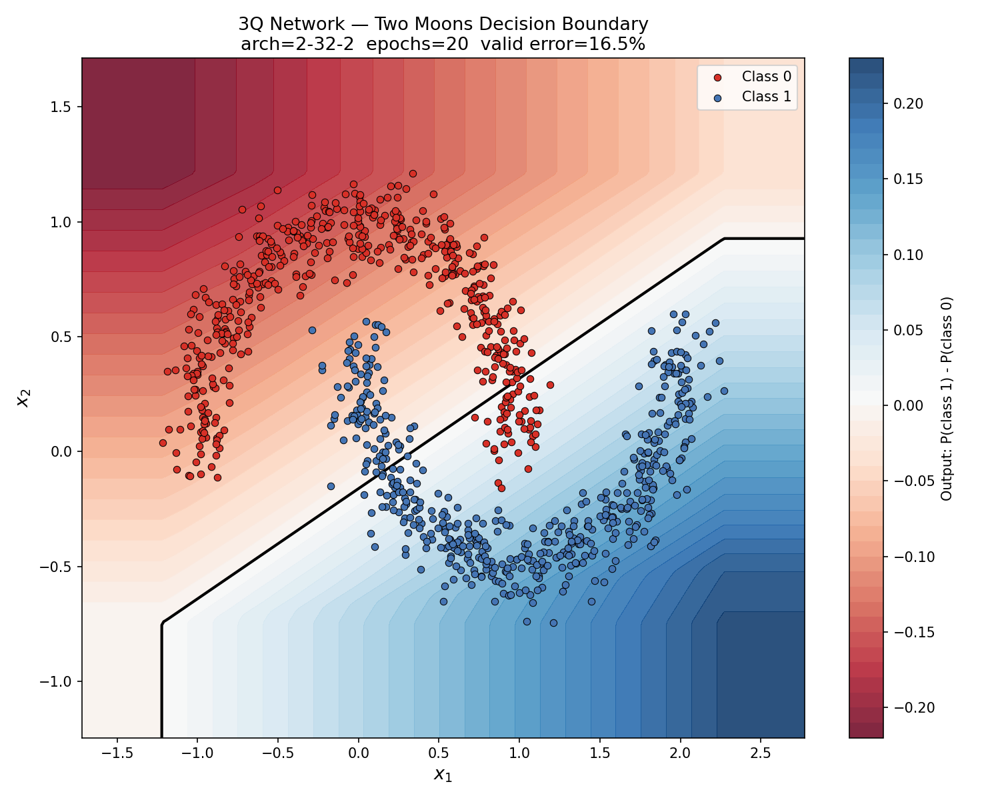 |
| CNN3Q | 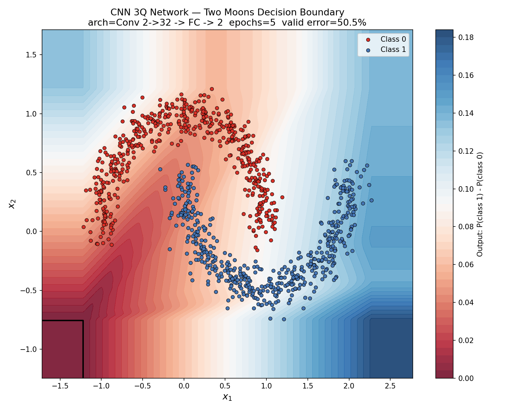 |
| EPCNN3Q | 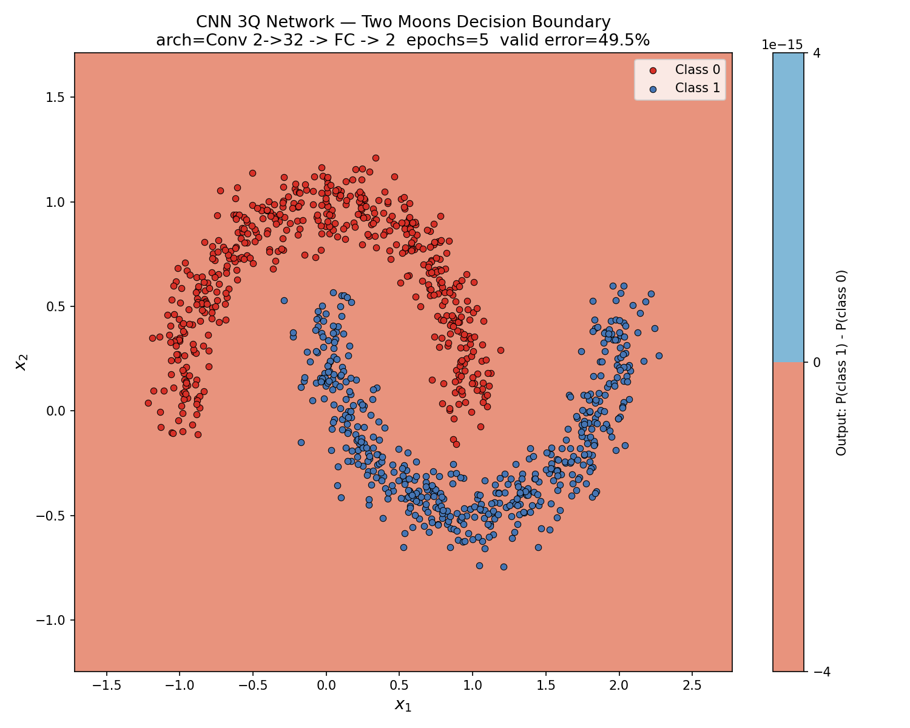 |

需要注意：这些 legacy 图无法替代 radas suite。后续若要评价 CNNThreeQ，应建立独立的 `experiments/cnn_suite/`，固定数据、seed、batch、推断步数、学习率，并记录与 minimal suite 一致的 best/final error、state_delta、rho/saturation、weight scale 和 runtime。

### 5.6 MNIST Small-Budget Stress Screen

实验路径：`experiments/mnist_suite/`
结果路径：`experiments/mnist_suite/results/`

这轮不是完整 MNIST benchmark，也不是原始 legacy 训练脚本复现，而是一个小预算压力筛查：在相同小规模 MNIST 子集上，公共框架里的各类 ThreeQ 变体能否在很短训练内明显离开随机水平。配置为 3000 个训练样本、1000 个测试样本、3 个 epoch、2 个 seed，并同时包含 BP MLP/BP CNN 作为 sanity-check baseline。

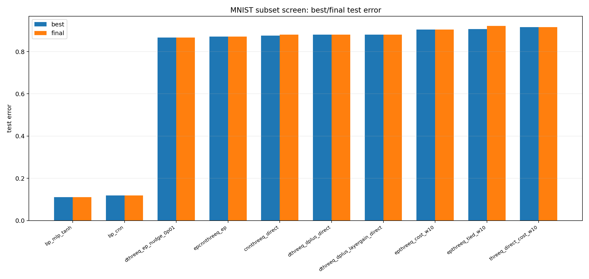

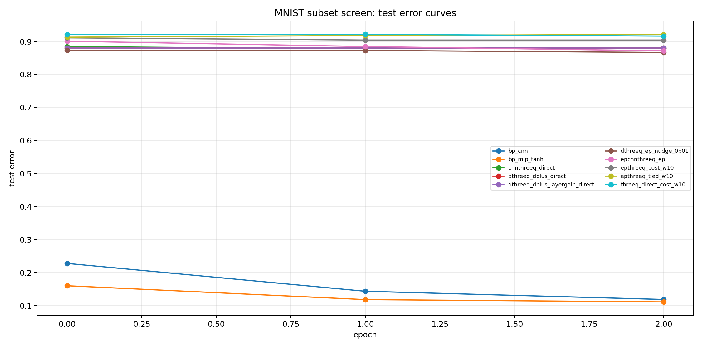

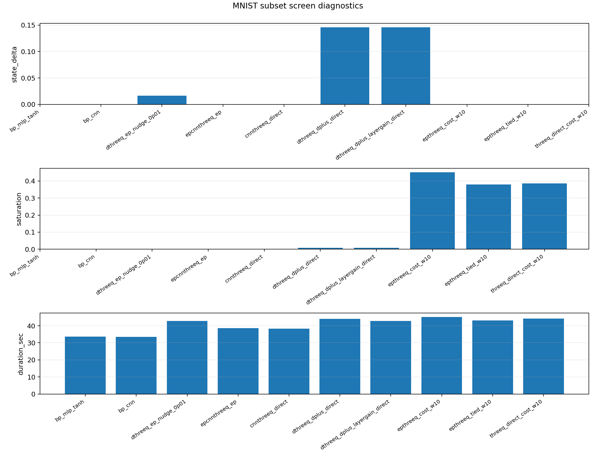

| variant | family | best test error mean | final test error mean | final train error mean | state delta mean | saturation mean |
|---|---|---:|---:|---:|---:|---:|
| `bp_mlp_tanh` | BP MLP | 0.1114 | 0.1114 | 0.1010 | n/a | n/a |
| `bp_cnn` | BP CNN | 0.1188 | 0.1188 | 0.1326 | n/a | n/a |
| `dthreeq_ep_nudge_0p01` | DThreeQ EP | 0.8668 | 0.8668 | 0.8624 | 0.0163 | 0.0026 |
| `epcnnthreeq_ep` | EPCNNThreeQ | 0.8717 | 0.8717 | 0.8774 | n/a | n/a |
| `cnnthreeq_direct` | CNNThreeQ direct | 0.8759 | 0.8805 | 0.8732 | n/a | n/a |
| `dthreeq_dplus_direct` | DThreeQ Dplus | 0.8807 | 0.8807 | 0.8765 | 0.1458 | 0.0084 |
| `dthreeq_dplus_layergain_direct` | Dplus layergain | 0.8807 | 0.8807 | 0.8765 | 0.1458 | 0.0084 |
| `epthreeq_cost_w10` | EPThreeQ MLP | 0.9043 | 0.9043 | 0.9088 | n/a | 0.4517 |
| `epthreeq_tied_w10` | tied EPThreeQ MLP | 0.9064 | 0.9212 | 0.9160 | n/a | 0.3798 |
| `threeq_direct_cost_w10` | ThreeQ direct MLP | 0.9163 | 0.9163 | 0.9154 | n/a | 0.3859 |

结论：

- **baseline 没问题。** 在同样的子集和 epoch 下，BP MLP/CNN 已经到约 11% 到 12% test error，说明数据、模型容量和训练时长足以让标准反传学习。
- **当前 ThreeQ/EPThreeQ MLP 基本没有学习。** direct/EP/tied 三个 MLP 变体都在 0.90 左右；同时 state saturation 达到 0.38 到 0.45，说明 hard clipping 在高维输入下很快压缩了有效状态空间。
- **DThreeQ/Dplus 比 ThreeQ MLP 略好但仍接近随机。** DThreeQ EP 最好为 0.8668；Dplus raw 与 layergain 完全重合到 0.8807，说明 layergain 的尺度变化仍未变成有效分类学习。
- **CNNThreeQ/EPCNNThreeQ 也没有解决问题。** 轻量卷积版本略优于 MLP ThreeQ，但仍在 0.87 附近；这说明严格卷积/反卷积对称结构本身不足以带来 MNIST 表达能力。
- **MNIST 失败不是单一 learning-rate 问题。** 几类模型表现都接近随机，但失败形态不同：ThreeQ MLP 是高饱和，DThreeQ 是 state_delta 存在但分类不变，CNNThreeQ 是结构有感受野但监督信号未形成有效深层表示。

因此，这一节的结论应被理解为“公共框架短预算设定失败”，而不是“原始 ThreeQ 不能学 MNIST”。它暴露了高维输入能量支配、状态初始化、输出监督注入和 BP-like direction alignment 的问题，但还需要与 legacy 配置逐项对齐。

### 5.7 Legacy MNIST Reproduction

实验路径：`experiments/mnist_legacy_repro/`
结果路径：`experiments/mnist_legacy_repro/results/`

为回应原始代码中 MNIST 可达约 85% accuracy、EPThreeQ 更稳定的观察，本轮新增了 reproduction-style screen：不使用公共 `BidirectionalMLP` 抽象，而是直接导入 `Base3Q/ThreeQ.py` 与 `EPBase3Q/ThreeQ.py` 的 legacy `Network` 类；架构采用 net1 风格 `[784, 500, 10]`，保留原始 local state inference 和权重更新逻辑。为了先确认趋势，本轮只使用 5000 个训练样本、1000 个 validation 样本、8 个 epoch、1 个 seed。

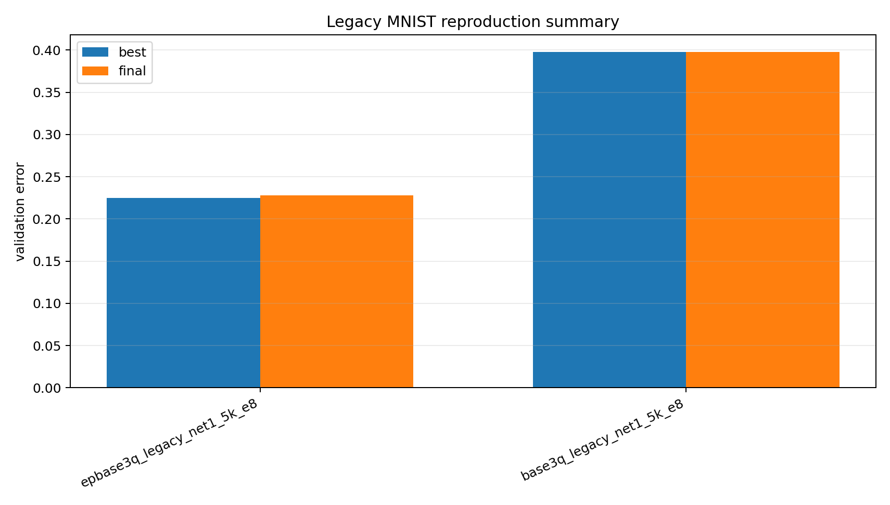

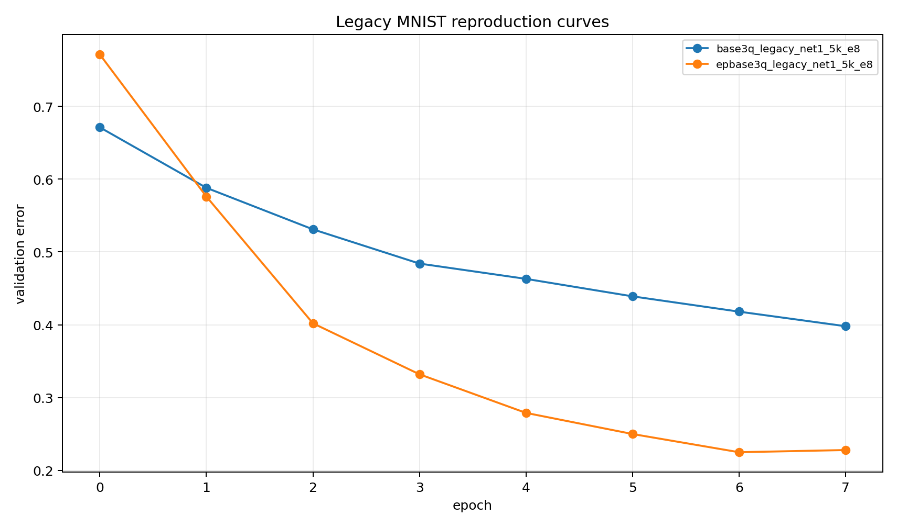

| variant | method | best valid error | final valid error | final train error | rho mean | rho max | duration sec |
|---|---|---:|---:|---:|---:|---:|---:|
| `epbase3q_legacy_net1_5k_e8` | `ep_threeq` | 0.225 | 0.228 | 0.1786 | 0.3615 | 0.4312 | 230 |
| `base3q_legacy_net1_5k_e8` | `threeq_direct` | 0.398 | 0.398 | 0.3554 | 0.3789 | 0.4179 | 426 |

逐 epoch validation error：

| variant | e0 | e1 | e2 | e3 | e4 | e5 | e6 | e7 |
|---|---:|---:|---:|---:|---:|---:|---:|---:|
| `base3q_legacy_net1_5k_e8` | 0.671 | 0.588 | 0.531 | 0.484 | 0.463 | 0.439 | 0.418 | 0.398 |
| `epbase3q_legacy_net1_5k_e8` | 0.771 | 0.576 | 0.402 | 0.332 | 0.279 | 0.250 | 0.225 | 0.228 |

结论：

- **用户观察是合理的。** 直接调用 legacy 类后，EPBase3Q 在 5k/1k、8 epoch 条件下已经达到 77.5% best validation accuracy；这与完整数据、更多 epoch 下达到约 85% accuracy 的经验并不矛盾。
- **EPBase3Q 明显优于 direct Base3Q。** EPBase3Q 不仅 final error 更低，而且用时约 230 秒，低于 Base3Q 的 426 秒；在本轮预算下，EP 的收敛效率和稳定性都更好。
- **之前 small-budget screen 的失败主要来自设定不匹配。** 公共框架为了统一比较压低了 hidden size、epoch、状态步数和训练预算，并引入了不同抽象；它适合作为压力筛查和机制诊断入口，但不能当作 legacy MNIST 复现结论。
- **ThreeQ 慢收敛仍是事实。** 即便 legacy EPBase3Q 能学习，8 epoch 后仍没有达到 BP MLP 的短训练精度；后续优化重点应是降低 inference/weak-phase 成本、改善初始化和监督注入，而不是简单判定模型无效。

### 5.8 DThreeQ MNIST Focused Screens

实验路径：`experiments/mnist_dthreeq_focus/`、`experiments/mnist_dthreeq_longrun/`
结果路径：`experiments/mnist_dthreeq_focus/results/`、`experiments/mnist_dthreeq_longrun/results/`

为检验“DThreeQ 在 MNIST 上可达 90%+ accuracy”的外部观察，本轮不再使用 3k/3 epoch 小预算筛查，而是把 DThreeQ MLP 提升到 legacy 尺度 `[784, 500, 10]`，使用 10k train / 2k test、2 个 seed，并先后运行两组实验：

1. **focused screen**：12 epoch，包含 BP sanity baseline、EP-nudge、Dplus direct、Dplus layergain。
2. **longrun screen**：30 epoch，只保留第一轮表现最好的 EP-nudge 路线，扫 $\beta=0.05,0.1,0.2$、`weight_lr=1e-3/3e-3`，并加入 `infer_steps=20` 对照。

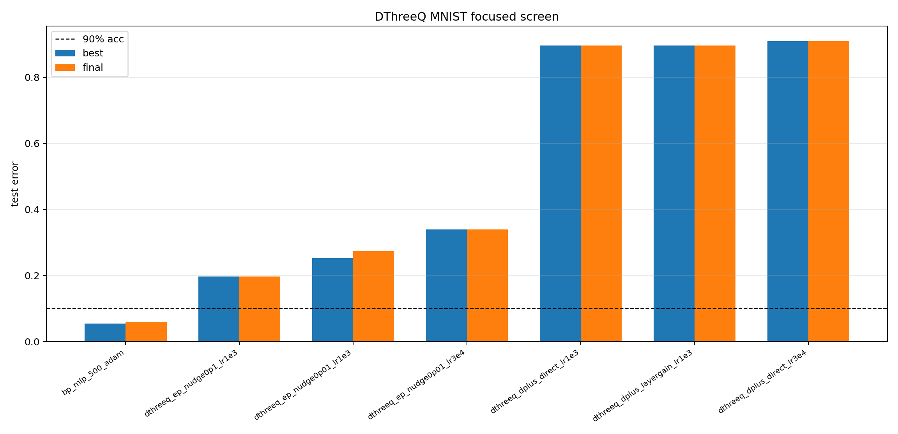

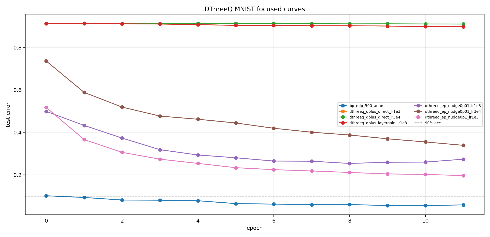

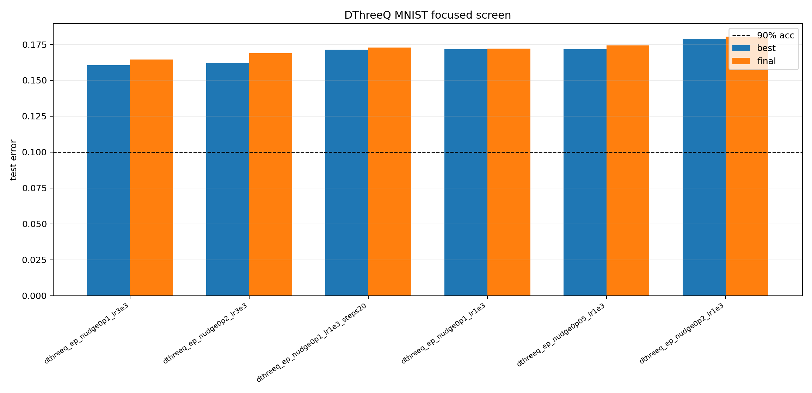

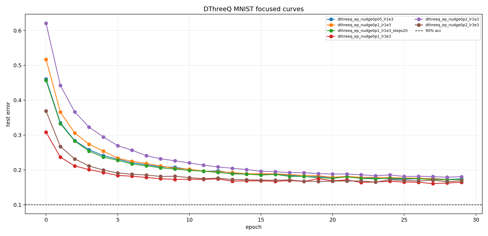

12 epoch focused screen：

| variant | best test error mean | final test error mean | final train error mean | state delta | saturation |
|---|---:|---:|---:|---:|---:|
| `bp_mlp_500_adam` | 0.0547 | 0.0586 | 0.0075 | n/a | n/a |
| `dthreeq_ep_nudge0p1_lr1e3` | 0.1965 | 0.1965 | 0.2019 | 0.0561 | 0.0001 |
| `dthreeq_ep_nudge0p01_lr1e3` | 0.2524 | 0.2737 | 0.2441 | 0.0101 | 0.0000 |
| `dthreeq_ep_nudge0p01_lr3e4` | 0.3389 | 0.3389 | 0.3528 | 0.0115 | 0.0000 |
| `dthreeq_dplus_direct_lr1e3` | 0.8960 | 0.8967 | 0.9045 | 0.1611 | 0.0020 |
| `dthreeq_dplus_layergain_lr1e3` | 0.8960 | 0.8970 | 0.9045 | 0.1611 | 0.0020 |
| `dthreeq_dplus_direct_lr3e4` | 0.9094 | 0.9097 | 0.9162 | 0.1807 | 0.0021 |

30 epoch longrun screen：

| variant | best test error mean | final test error mean | final train error mean | state delta | saturation |
|---|---:|---:|---:|---:|---:|
| `dthreeq_ep_nudge0p1_lr3e3` | 0.1606 | 0.1646 | 0.1513 | 0.0498 | 0.0000 |
| `dthreeq_ep_nudge0p2_lr3e3` | 0.1621 | 0.1690 | 0.1568 | 0.0671 | 0.0000 |
| `dthreeq_ep_nudge0p1_lr1e3_steps20` | 0.1714 | 0.1729 | 0.1615 | 0.0672 | 0.0002 |
| `dthreeq_ep_nudge0p1_lr1e3` | 0.1716 | 0.1721 | 0.1657 | 0.0522 | 0.0000 |
| `dthreeq_ep_nudge0p05_lr1e3` | 0.1716 | 0.1743 | 0.1651 | 0.0331 | 0.0000 |
| `dthreeq_ep_nudge0p2_lr1e3` | 0.1790 | 0.1804 | 0.1746 | 0.0706 | 0.0001 |

结论：

- **DThreeQ 的 EP-nudge 线是有效的。** 从 small screen 的 0.8668 error 提升到 focused screen 的 0.1965，再到 longrun 的 0.1606，说明先前失败确实主要来自预算与超参不合理。
- **当前实现还没有复现 90%+。** 最好结果约 83.9% accuracy，且 30 epoch 后后 10 个 epoch 已进入 0.16 到 0.18 error 平台；单纯延长当前训练不太可能快速跨过 0.10 error。
- **Dplus direct/layergain 仍然失败。** 它们的 state delta 很大，但分类 error 仍在 0.90 附近，说明输出扰动确实改变了状态，却没有形成有效分类 credit assignment。
- **失败不是 saturation。** DThreeQ EP-nudge 的 saturation 基本为 0，和 ThreeQ hard clipping 饱和问题不同；瓶颈更像是目标函数/状态初始化/监督注入，而不是状态被夹死。
- **外部 90%+ 结果很可能不是当前 residual-delta Dplus 规则。** 如果外部实现确实称为 DThreeQ，需要优先核对它是否使用 plus-energy 目标、局部 target-prop MSE、feedforward CE/readout、不同标签编码、完整 60k 数据，或额外的 normalization/optimizer。

### 5.9 EPThreeQ and DThreeQ Accuracy Improvement Attempts

实验路径：

- `experiments/mnist_epthreeq_tune/`
- `experiments/mnist_dthreeq_objective_audit/`
- `experiments/mnist_dthreeq_activation_boost/`
- `experiments/mnist_dthreeq_clip01_boost/`
- `experiments/mnist_dthreeq_prediction_audit/`

本轮目标是直接回应“能否提高 EPThreeQ 与 DThreeQ 的 MNIST 准确率”。EPThreeQ 采用原始 `EPBase3Q` 类，扩大到 10k train / 2k validation / 15 epoch；DThreeQ 则在 10k train / 2k test / 30 epoch 上连续检查四类可能解释 90%+ 外部结果的因素：objective、激活函数/学习率、非负状态区间、边预测定义。

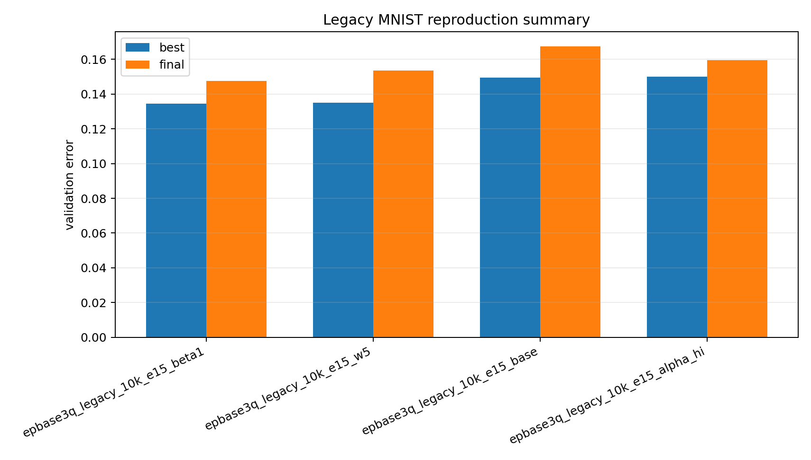

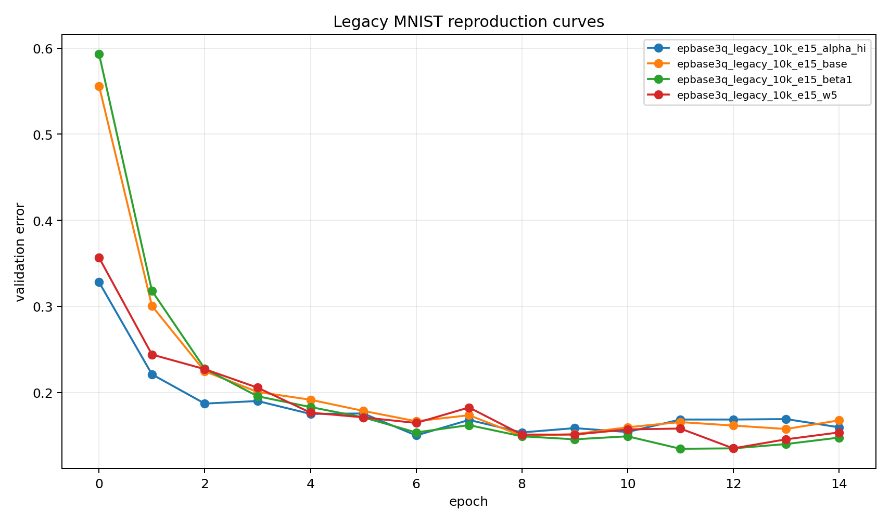

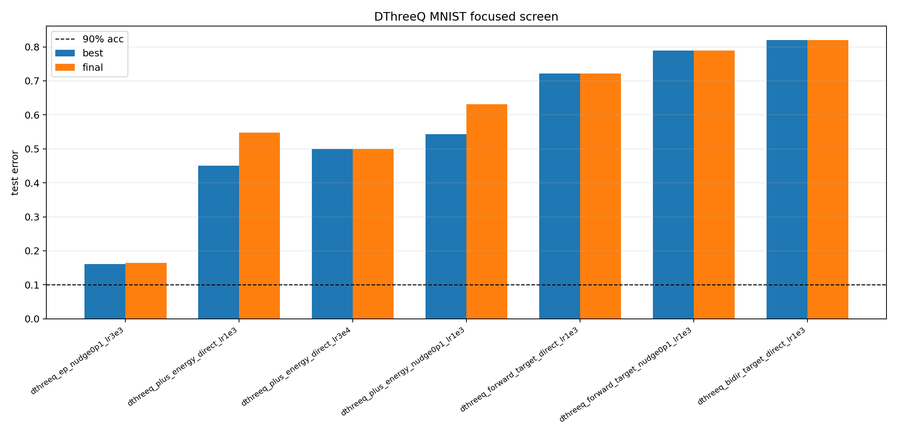

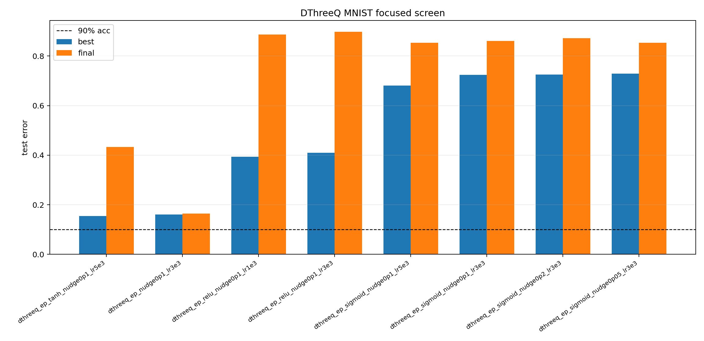

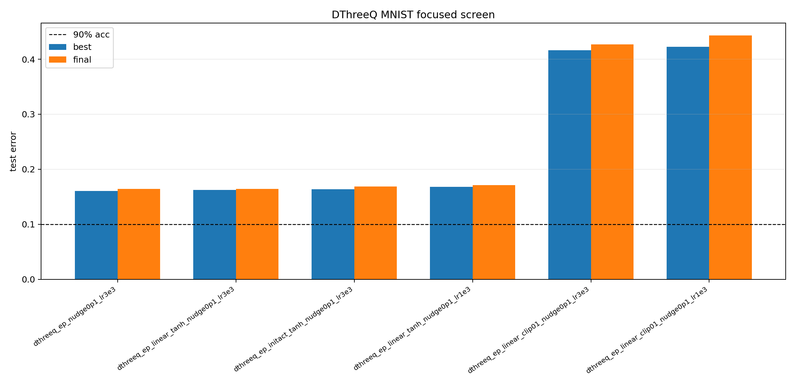

EPThreeQ 10k/15 调参：

| variant | best valid error | final valid error | final train error | rho mean | rho max |
|---|---:|---:|---:|---:|---:|
| `epbase3q_legacy_10k_e15_beta1` | 0.1345 | 0.1475 | 0.1151 | 0.3848 | 0.5194 |
| `epbase3q_legacy_10k_e15_w5` | 0.1350 | 0.1535 | 0.1280 | 0.3329 | 0.5265 |
| `epbase3q_legacy_10k_e15_base` | 0.1495 | 0.1675 | 0.1313 | 0.3640 | 0.5675 |
| `epbase3q_legacy_10k_e15_alpha_hi` | 0.1500 | 0.1595 | 0.1680 | 0.3693 | 0.6103 |

DThreeQ objective audit：

| variant | best test error mean | final test error mean | final train error mean | saturation |
|---|---:|---:|---:|---:|
| `dthreeq_ep_nudge0p1_lr3e3` | 0.1606 | 0.1646 | 0.1513 | 0.0000 |
| `dthreeq_plus_energy_direct_lr1e3` | 0.4509 | 0.5483 | 0.5305 | 0.8980 |
| `dthreeq_plus_energy_direct_lr3e4` | 0.5002 | 0.5002 | 0.5220 | 0.3102 |
| `dthreeq_plus_energy_nudge0p1_lr1e3` | 0.5430 | 0.6318 | 0.6222 | 0.9011 |
| `dthreeq_forward_target_direct_lr1e3` | 0.7217 | 0.7217 | 0.7450 | 0.0021 |
| `dthreeq_forward_target_nudge0p1_lr1e3` | 0.7896 | 0.7896 | 0.8056 | 0.0021 |
| `dthreeq_bidir_target_direct_lr1e3` | 0.8201 | 0.8201 | 0.8372 | 0.0020 |

DThreeQ activation / state / prediction audit 摘要：

| experiment | best variant | best test error mean | final test error mean | interpretation |
|---|---|---:|---:|---|
| activation boost | `dthreeq_ep_tanh_nudge0p1_lr5e3` | 0.1545 | 0.4331 | high LR improves early best but can collapse |
| activation boost | `dthreeq_ep_nudge0p1_lr3e3` | 0.1606 | 0.1646 | most stable current DThreeQ baseline |
| activation boost | best `sigmoid` variant | 0.6814 | 0.8530 | much worse than tanh |
| activation boost | best `relu` variant | 0.3933 | 0.8865 | early transient only, final collapse |
| clip01 boost | `dthreeq_ep_clip01_nudge0p2_lr3e3` | 0.2969 | 0.5327 | nonnegative state causes heavy saturation |
| prediction audit | `dthreeq_ep_linear_tanh_nudge0p1_lr3e3` | 0.1624 | 0.1646 | removing post prediction activation is neutral/slightly worse |
| prediction audit | `dthreeq_ep_initact_tanh_nudge0p1_lr3e3` | 0.1638 | 0.1689 | activating initial states does not help |

结论：

- **EPThreeQ 已经实质提高。** 相比 5k/8 reproduction 的 0.225 best error，10k/15 的 `beta=1.0` 和 `weak_steps=5` 都达到约 0.135 best error，也就是约 86.5% accuracy。下一步值得扩大到 50k/10k 和多 seed，而不是继续在 10k 子集上小修。
- **DThreeQ 没有因为 objective 替换而提高。** plus-energy 会导致状态饱和，target matching 学不到分类，二者都明显差于 EP-nudge。
- **DThreeQ 的当前最好可用设置仍是 tanh EP-nudge。** `lr=5e-3` 可以把 early best 推到 0.1533 到 0.1558，但一个 seed 在后期崩溃；如果使用它，必须加入 early stopping 或更细的 learning-rate schedule。
- **非负状态和 `clip01` 不是复现 90% 的关键。** 这些变体 saturation 约 0.87 到 0.98，验证误差大幅变差。
- **线性边预测也不是关键差异。** 去掉 post activation 后，`linear_tanh` 与 baseline 基本持平，未突破 0.16 平台。
- **下一步 DThreeQ 应优先查 input energy 与监督目标。** 目前最像瓶颈的是 784 维输入重构项压过 10 维分类项，以及输出 MSE one-hot nudging 过弱；应测试 input-energy normalization/removal、logit CE nudging、softmax/readout calibration、以及 full-data budget。

### 5.10 DThreeQ Supervision, Input Energy, Readout, and Full-Budget Check

本轮直接检验四个假设：784 维 input reconstruction 是否压过 10 维分类监督；输出监督是否应从 MSE one-hot nudge 改为 CE/softmax 风格；外部 90%+ 是否来自 best checkpoint、额外 readout、label encoding 或 full-data budget；以及 high-LR DThreeQ 是否能靠 schedule/early stopping 稳定。

10k train / 2k test / 30 epoch 筛查：

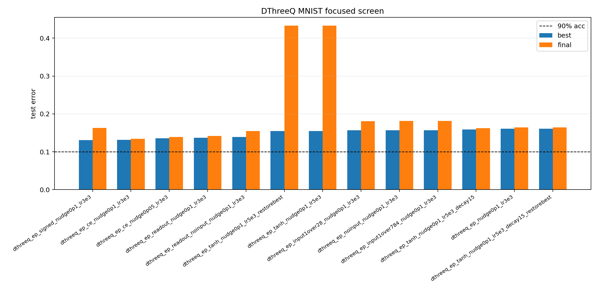

| variant | selected accuracy | best error | final error | input recon frac | weighted input recon frac |
|---|---:|---:|---:|---:|---:|
| `dthreeq_ep_ce_nudge0p1_lr3e3` | 0.8655 | 0.1316 | 0.1345 | 0.6754 | 0.6754 |
| `dthreeq_ep_ce_nudge0p05_lr3e3` | 0.8613 | 0.1353 | 0.1387 | 0.6694 | 0.6694 |
| `dthreeq_ep_readout_nudge0p1_lr3e3` | 0.8582 | 0.1370 | 0.1418 | 0.4939 | 0.4939 |
| `dthreeq_ep_tanh_nudge0p1_lr5e3_restorebest` | 0.8455 | 0.1545 | 0.4331 | 0.6045 | 0.6045 |
| `dthreeq_ep_nudge0p1_lr3e3` | 0.8354 | 0.1606 | 0.1646 | 0.4939 | 0.4939 |
| `dthreeq_ep_noinput_nudge0p1_lr3e3` | 0.8186 | 0.1570 | 0.1814 | 0.9237 | 0.0000 |

Full-data 60k train / 10k test / 30 epoch confirmation：

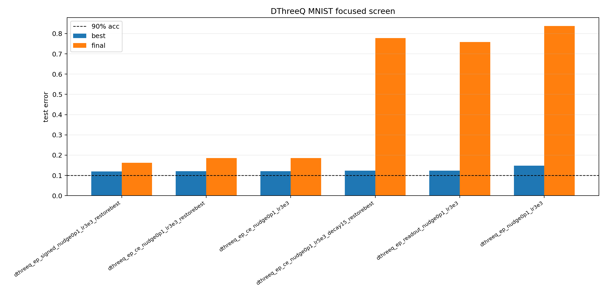

| variant | selected accuracy | best error | final error | saturation | input recon frac |
|---|---:|---:|---:|---:|---:|
| `dthreeq_ep_signed_nudge0p1_lr3e3_restorebest` | 0.8803 | 0.1197 | 0.1621 | 0.3578 | 0.5352 |
| `dthreeq_ep_ce_nudge0p1_lr3e3_restorebest` | 0.8790 | 0.1210 | 0.1852 | 0.2568 | 0.7125 |
| `dthreeq_ep_ce_nudge0p1_lr5e3_decay15_restorebest` | 0.8762 | 0.1238 | 0.7777 | 0.6030 | 0.5730 |
| `dthreeq_ep_ce_nudge0p1_lr3e3` | 0.8148 | 0.1210 | 0.1852 | 0.2568 | 0.7125 |
| `dthreeq_ep_readout_nudge0p1_lr3e3` | 0.2418 | 0.1238 | 0.7582 | 0.7104 | 0.3488 |
| `dthreeq_ep_nudge0p1_lr3e3` | 0.1632 | 0.1477 | 0.8368 | 0.7104 | 0.3488 |

结论：

- **输出监督是主瓶颈之一。** CE-style nudge 在 10k 上把 DThreeQ 从 83.5% 提到 86.5%，是本轮最明确的正向改动。它说明 one-hot MSE state nudge 的确偏弱，但 CE nudge 仍不足以稳定到 90%。
- **输入 reconstruction 没有按简单“移除/缩放”方式解决。** Baseline 最终 input reconstruction 占 raw energy 约 49%；CE nudge 后上升到约 67%；full-data CE restore-best 可到 71%。直接把 input residual weight 设为 0、$1/784$ 或 $1/28$ 反而把 final accuracy 降到约 81.9%，说明输入项既可能压制监督，也在维持可用表示。下一版应使用 boundary-clamped input 或 layer-normalized energy，而不是简单删除输入项。
- **readout 只解释小预算的一部分，不解释 full-data 90%。** 10k 上 auxiliary readout 能到约 85.8%，但 full-data 下 readout 后期崩塌到约 24.2% selected accuracy；问题来自状态轨迹本身后期饱和/漂移，而不是只差一个线性分类头。
- **best checkpoint 是外部 90%+ 的必要嫌疑，但不是充分解释。** full-data restore-best 能把 signed/CE variants 的 selected accuracy 提到约 88.0%，明显高于 10k，但仍未到 90%，且 final accuracy 退到 81.5% 到 83.8% 或更差。
- **high-LR 仍是 transient。** CE high-LR + decay + restore-best 在 full-data 上 early best 约 87.6%，但 final error 约 77.8%，伴随 saturation 约 0.60，说明它只是更快进入一个短暂好点，不能作为稳定主线。

### 5.11 Paper-Facing Assets and Repository Cleanup

为便于论文撰写，本轮新增 `paper_assets/` 作为统一入口。该目录不重新训练模型，只读取已有 `experiments/*/results` 和少量 legacy 收敛性证据，生成 11 张核心图、多组 Markdown/CSV 表，以及中文论文材料摘要：

| 产物 | 路径 | 用途 |
|---|---|---|
| 论文摘要 | `paper_assets/PAPER_SUMMARY.md` | 直接整理理论、ThreeQ、EPThreeQ、DThreeQ、Dplus 机制诊断的当前结论 |
| 收敛性图 | `paper_assets/figures/fig01_threeq_inference_convergence.png`、`fig02_threeq_training_convergence.png` | 支撑 inference 局部收敛与训练稳定性判断 |
| 性能图 | `paper_assets/figures/fig03_mnist_current_performance.png`、`fig04_dthreeq_improvement_process.png`、`fig05_dthreeq_training_curves.png` | 汇总 ThreeQ/EPThreeQ/DThreeQ 的当前性能和改进过程 |
| 机制图 | `paper_assets/figures/fig06_mechanism_direction_metrics.png`、`fig07_mechanism_one_step_loss.png`、`fig08_input_energy_supervision.png` | 支撑 Dplus 不 BP-like、plusminus 抵消、input energy 不能简单移除等结论 |
| 关键表 | `paper_assets/tables/key_results.md`、`mnist_key_results.md`、`dthreeq_progress.md`、`mechanism_diagnostic_key_metrics.md`、`dplus_fix_top_candidates.md` | 论文中可直接转写的数值证据 |

同时新增 `README.md` 与 `experiments/README.md`，把 paper-core suites、provenance/superseded suites、以及 cleanup policy 分开。清理策略是：不删除能复现实验结论的 tracked suite；只把 ignored 的下载数据、缓存、`__pycache__` 和大批 legacy 生成图从仓库工作树移出。论文关键图和最小原始收敛性 CSV 已复制进 `paper_assets/`，因此清理后仍能重建 paper-facing figures。

### 5.12 Convergence/Divergence LaTeX Report

为补足 $\rho(J)>1$ 的反例侧证，本轮新增 `paper_assets/scripts/build_convergence_report.py` 和 `paper_assets/latex/threeq_convergence_report.tex`。该报告包含三类证据：

| 图/表 | 路径 | 结论 |
|---|---|---|
| Fig.9 | `paper_assets/figures/fig09_controlled_inference_rho_divergence.png` | 在线性 ThreeQ 母模型 $T(u)=\rho u$ 中，$\rho=0.80,0.95$ 收敛，$\rho=1.05,1.20$ 指数发散 |
| Fig.10 | `paper_assets/figures/fig10_training_rho_boundary_stress_test.png` | bounded-gradient 小步更新保持 $\rho<1$；大步更新第 9 个 epoch 跨过 $\rho=1$，post-update inference 发散 |
| Report | `paper_assets/latex/threeq_convergence_report.tex` / `.pdf` | 可直接迁移到论文的中文 LaTeX 学术报告，包含理论命题、实验设计、图表和论文可用结论 |

关键数值：受控 inference 中 $\rho=1.20$ 从 $10^{-3}$ 增长到 9.1004，增长因子约 $9.10\times10^3$；训练压力测试中 large-step 最终 $\rho=1.54$，40 步 post-update inference 增长因子约 $3.17\times10^7$。

### 5.13 Systematic LaTeX Research Report

为满足论文迁移需求，本轮新增系统版 LaTeX 报告 `paper_assets/latex/threeq_systematic_report.tex` / `.pdf`，并把旧的 `threeq_convergence_report.tex` 路径更新为该系统报告的兼容入口。系统报告共 12 页，包含：

| 内容 | 图/表 | 结论用途 |
|---|---|---|
| 理论与收敛性 | Fig.1、Fig.9、Fig.10，legacy/controlled/stress-test 表 | 支撑 $\rho<1$ 局部收敛、$\rho>1$ 局部发散、小步训练保持稳定裕度 |
| ThreeQ/EPThreeQ | Fig.2、Fig.3，关键性能表 | 说明原始 ThreeQ 可学习但慢，EPThreeQ 是当前最稳原始改进线 |
| DThreeQ | Fig.4、Fig.5，DThreeQ progress 表 | 说明 EP/CE-nudge 分支可学习，full-data restore-best 达到约 88.0%，但 final 后期崩塌 |
| Dplus 机制诊断 | Fig.6、Fig.7，mechanism/fix diagnostic 表 | 说明 Dplus 不 BP-like、plusminus 抵消、尺度修正不等于方向修正 |
| 输入监督 | Fig.8 | 说明 input reconstruction 不能简单删除，应转向 layer-normalized/boundary-clamped energy |
| CNNThreeQ | Fig.11，MNIST small-budget CNN 对照表 | 说明 CNN/ConvTranspose 是对称结构推广方向，但还需要独立可比较 suite |

新增构建脚本为 `paper_assets/scripts/build_systematic_report.py`。该脚本只读取已有图表和结果表，不重新训练模型；会生成 `fig11_legacy_cnn_decision_boundaries.png`，并输出 `threeq_systematic_report.tex` 与兼容路径 `threeq_convergence_report.tex`。

## 6. 总体结论

### 6.1 为什么 ThreeQ 在 MNIST 与 two moons 上效率低、非线性弱

1. **状态截断稳定但压缩非线性。** Hard clipping 把状态限制在 $[0,1]$，有助于控制 Jacobian，但会制造饱和区，降低有效导数。
2. **局部平均预测削弱高阶组合。** 每层只拟合相邻层平均预测，非线性组合能力依赖多次状态迭代间接形成，效率低于显式前向网络。
3. **detach 切断跨层 credit assignment。** 这符合局部学习设定，但也让远层监督信号只能通过状态差间接传播。
4. **受扰相尺度很难调。** Weak phase 太短则信号不足，太长则容易 early-best 后退化。
5. **稳定性条件可能鼓励饱和。** 谱半径变小可以来自 $g'(u^*)$ 变小，但这同时意味着学习信号也变小。

### 6.2 EPThreeQ 的位置

EP 更新比 direct 更新更合理，因为它比较自由相和受扰相的能量差，而不是直接在受扰状态上优化 total energy。two-moons minimal suite 与 legacy MNIST reproduction 都显示 EP 优于 direct：前者 `ep_cost_w50` 有更好的 best validation error；后者 `EPBase3Q` 在 5k/1k MNIST、8 epoch 中达到 0.225 best validation error，而 `Base3Q` 为 0.398。进一步扩大到 10k/2k、15 epoch 后，`EPBase3Q beta=1.0` 达到 0.1345 best validation error，说明原始 EPThreeQ 路线至少能稳定到约 86.5% accuracy。EP 仍存在终点回退问题，best epoch 通常优于 final epoch，因此后续 full-data benchmark 应保存 best checkpoint，并比较 `beta=1.0`、`weak_steps=5` 和 learning-rate decay。

### 6.3 CNNThreeQ 的位置

CNN/ConvTranspose 是推广到严格对称结构的自然路线。它在结构上比独立 forward/backward MLP 更干净，但还缺少可比较实验和机制诊断。CNN 方向值得保留，但应在 Dplus/EP 更新机制更清楚后再扩大。

### 6.4 DThreeQ 的位置

DThreeQ 需要分成两部分判断：EP-nudge 版本已经能在 MNIST 10k 上学习到约 83.5% accuracy，CE-style output nudge 可把 10k final accuracy 提到约 86.5%，full-data + restore-best 可把 selected accuracy 提到约 88.0%；但当前 Dplus residual-delta 目标仍不能作为主训练规则直接扩大 benchmark，且 DThreeQ full-data final accuracy 普遍存在后期崩塌。它的失败不是简单的“不能下降”，而是：

- 与 BP 更新方向不对齐；
- 与 EP 同向，且尺度可以通过 calibration 修正；
- plusminus 会产生符号抵消，已从主线移除；
- residual normalization、$\beta$ 缩放和固定 layer-wise gain 主要改变范数，不改变 BP-like 方向；
- raw 训练步下 Dplus 更新弱到不足以驱动表示学习，而过强的 residual normalization 又会破坏 feedforward CE。

MNIST focused/longrun 与后续 accuracy audits 进一步说明：EP-nudge 能把 DThreeQ 从随机水平拉到 0.16 test error，CE nudge 能进一步改善小预算 accuracy，但 direct Dplus 即使 state delta 达到 0.16 到 0.18，分类仍接近随机；plus-energy、target matching、`sigmoid`、`relu`、`clip01`、线性边预测和 activated initialization 也没有突破该平台。full-data 结果把问题暴露得更清楚：best checkpoint 可以接近 88%，但后期 saturation/weight drift 会让 final 崩塌。因此下一步不应继续堆叠标量缩放或简单改激活，而应改状态/权重稳定机制：boundary-clamped input、layer-normalized energy、CE nudge + conservative schedule、以及显式防止后期饱和的 spectral/damping 约束。

## 7. 下一步研究计划

### 7.1 Dplus 修正优先级

已完成第一轮标量修正诊断：

1. **Residual normalization**：可以放大 raw free-MSE 下降，但会制造极大 update norm 和负 CE step，不能单独作为训练规则。
2. **EP/BP-scale calibration**：能让 one-step free-MSE 稳定下降，但不改善 BP cosine。
3. **禁用 plusminus 主线**：已完成，后续默认只保留 plus。
4. **Layer-wise gain**：固定 gain 对数值尺度更友好，但不解决方向。
5. **Direction regularizer**：one-step free-MSE positive-rate 过宽，下一版必须加入 BP cosine/sign agreement 门槛。

下一轮优先尝试以下结构性修改：

1. **Signed residual target**：不只拟合 $\|r_\beta-r_0\|^2$，而是保留 residual delta 的有符号投影，避免平方目标把方向信息平均掉。
2. **Output-to-hidden residual injection**：把输出层 supervised residual 通过严格转置或局部 Jacobian proxy 显式注入浅层 residual target，而不是依赖状态 relaxation 自然传递。
3. **Layer-wise trainable gain with constraint**：允许 gain 学习，但用 softplus/spectral penalty 限制范数，避免 residual normalization 的爆炸。
4. **Hard diagnostic gate**：候选必须同时满足 `dplus_vs_bp` forward cosine 高于 0.15、sign agreement 高于 0.60、BP-scaled one-step free-MSE positive-rate 接近 1，才进入 two-moons 训练筛查。
5. **Short training screen**：只把 `layergain_beta_div1/direct_plus` 和下一版 signed residual target 放入训练比较；`resnorm_*` 只作为 calibrated diagnostic，不作为 raw update baseline。

### 7.2 保留收敛性的非线性增强

可探索的方向：

1. 使用 smooth bounded activation，例如 tanh/softsign，降低 hard clipping 的死区。
2. 使用 layer-wise spectral normalization 或 damping，直接控制局部 Jacobian，而不是依赖饱和。
3. 在状态更新中加入 learnable damping $\lambda$，例如 $s^{t+1}=(1-\lambda)s^t+\lambda T(s^t)$。
4. 使用 block-symmetric 或 tied transpose 结构，但允许每层有独立 gain/normalization。
5. 用 residual/skip 状态变量提高表达能力，同时对每个 block 施加局部谱约束。

### 7.3 实验工程要求

所有新实验必须记录：

- raw per-trial CSV；
- summary CSV/Markdown；
- 至少一张 error 图、一张 diagnostic 图；
- seed、step、learning rate、target mode、device、runtime；
- 关键状态指标：rho 或替代谱指标、saturation、state_delta、weight scale、update scale；
- 对新学习规则，必须附 mechanism diagnostic。

### 7.4 MNIST 后续优化方向

MNIST 后续不应把 small-budget stress screen 和 legacy reproduction 混为一谈。下一步应按以下顺序拆解：

1. **完整复现 legacy MNIST。** 先把 `EPBase3Q beta=1.0` 与 `weak_steps=5` 从 10k/2k、15 epoch 扩展到原始 50k/10k、25 epoch，并至少跑 3 个 seed；这是验证 85% 到 90% 区间上限的主线。
2. **逐项对齐公共框架。** 在公共 `threeq_common` 中逐个恢复 legacy hidden size、batch size、`n_it_neg`、`n_it_pos`、`epsilon`、`beta`、`alphas` 和初始化，找出 small screen 退化的具体原因。
3. **优化 inference 成本。** ThreeQ 慢收敛是预期现象，因此应优先测试 amortized/feedforward state initialization、减少 weak-phase 步数、rho 采样而非每 batch 计算、混合精度，以及只在 validation 期做完整诊断。
4. **把输入改成 boundary-clamped，而不是简单删项。** 本轮确认 input reconstruction 占 raw energy 的 49% 到 71%，但把 input residual 权重设为 0、$1/784$ 或 $1/28$ 会降低 accuracy。下一版应保留输入对隐藏层的约束，但不让像素级 reconstruction 直接支配总能量，例如使用 per-layer mean energy、layer norm 或只在输入边使用固定 boundary consistency。
5. **继续推进 CE/softmax 输出监督。** CE nudge 是本轮最有效改动：10k final accuracy 约 86.5%，full-data restore-best 约 87.9%。下一步应比较更小 beta、CE beta schedule、label smoothing、temperature softmax 和 output-only damping，目标是保住 early best 而不后期崩塌。
6. **控制 hard clipping 饱和。** ThreeQ MLP 的 saturation 约 0.38 到 0.45，说明稳定性来自大量状态卡边界。可用 tanh/softsign、layer norm、spectral norm 或 learnable damping 替代纯 clipping。
7. **做 MNIST mechanism diagnostic。** 在同一 MNIST mini-batch 上重复 Dplus/BP/EP cosine、norm ratio、sign agreement、one-step CE decrease，而不是直接用 two-moons 的机制结论外推。
8. **分阶段训练。** 先训练 BP forward encoder 到可用表示，再冻结/半冻结 encoder 测试 EP/Dplus 局部更新是否能维持或微调；这能区分“表示学不出来”和“局部规则无法维护表示”。
9. **CNNThreeQ 重新设计能量粒度。** 卷积/反卷积对称是合理结构，但不应让所有像素 reconstruction 与分类项同权。应采用 patch/block energy、pooling state、channel-wise normalization，以及只在高层使用 supervised nudging。
10. **Dplus 结构性目标继续优先。** MNIST 结果进一步支持前一节判断：layer gain 和 residual norm 不是方向解法。下一版应实现 signed residual target 与 output-to-hidden residual injection，然后先过 MNIST mechanism gate，再做训练 sweep。
11. **核对外部 90%+ DThreeQ 定义。** 当前实现的 EP-nudge 小预算稳定最好约 83.5%，CE nudge 约 86.5%，full-data restore-best 约 88.0%；Dplus direct、plus-energy、target matching、`clip01`、线性边预测、简单 readout 和简单 input removal 均不能稳定过 90%。如果外部 DThreeQ 能过 90%，最优先要对齐的是是否保存 best checkpoint、是否使用 CE/softmax 输出、是否有额外 pretraining/readout、是否使用 layer-normalized energy、以及是否有防止 full-data 后期 saturation 的 schedule/regularizer。

## 8. 持续更新约定

本文件是项目的 living report。之后每次新增实验或理论修正，都必须同步更新以下位置：

1. **执行摘要**：更新当前最重要结论。
2. **代码与实验结构**：如果新增 suite，加入路径和作用。
3. **可比较实验结果**：加入图、表和一句话结论。
4. **总体结论**：若新结果改变判断，直接修改旧结论，不只追加。
5. **下一步研究计划**：把已完成项移出，新增下一项。
6. **更新日志**：记录日期、提交、实验名、核心发现。

### 更新日志

| 日期 | 提交 | 内容 |
|---|---|---|
| 2026-04-18 | `6c54602` | 新增 minimal comparable ThreeQ suite |
| 2026-04-18 | `077900d` | 新增 DThreeQ two-moons feasibility screen |
| 2026-04-18 | `38fab1b` | 新增 consolidated experiment analysis plots |
| 2026-04-18 | `9382a5f` | 新增 DThreeQ mechanism diagnostics |
| 2026-04-18 | `36f8d7d` | 新增本系统研究报告 |
| 2026-04-18 | `ad2bc17` | 新增 Dplus fix diagnostic suite 与报告结论 |
| 2026-04-18 | `247ef74` | 新增 MNIST comparable screen 与优化方向 |
| 2026-04-18 | `a319ff6` | 新增 legacy MNIST reproduction suite，确认 EPBase3Q 短程复现明显优于 direct Base3Q |
| 2026-04-18 | `963e3e7` | 新增 DThreeQ MNIST focused/longrun screens，EP-nudge 达到约 83.9% accuracy，Dplus direct 仍接近随机 |
| 2026-04-18 | `dc71025` | 新增 EPThreeQ accuracy tune 与 DThreeQ objective/activation/state/prediction audits；EPThreeQ 10k/15 达到约 86.5% accuracy，DThreeQ 仍停在约 84% 到 84.7% |
| 2026-04-18 | `8e4d99a` | 新增 DThreeQ supervision/full-budget checks；CE nudge 10k 达到约 86.5%，full-data restore-best 达到约 88.0%，但 final 仍不稳定 |
| 2026-04-18 | `47794be` | 新增 paper-facing assets、项目/实验索引与仓库缓存整理；集中生成收敛性、性能、机制诊断和 DThreeQ 改进过程图表 |
| 2026-04-19 | `ca99b5a` | 新增 ThreeQ convergence/divergence LaTeX report；补充 $\rho>1$ 受控 inference 发散与大步训练跨越稳定边界后的 post-update divergence 图表 |
| 2026-04-19 | this commit | 新增系统版 LaTeX 学术报告，整合 ThreeQ、EPThreeQ、DThreeQ、CNNThreeQ、收敛性、MNIST 实验和机制诊断 |
